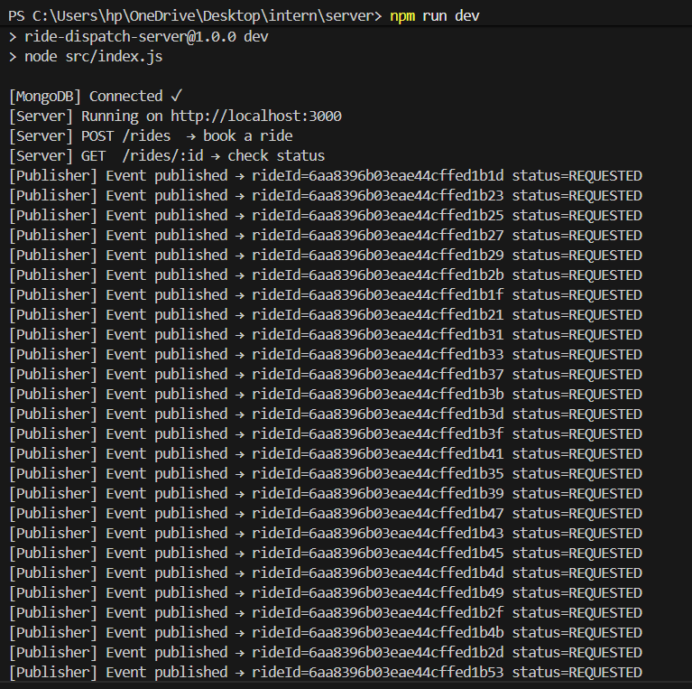
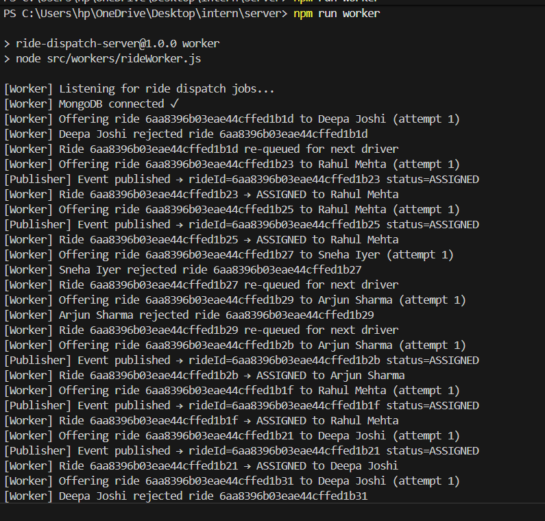
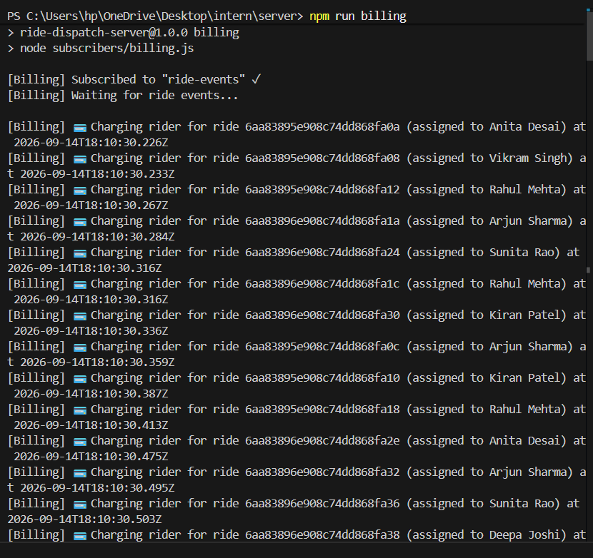
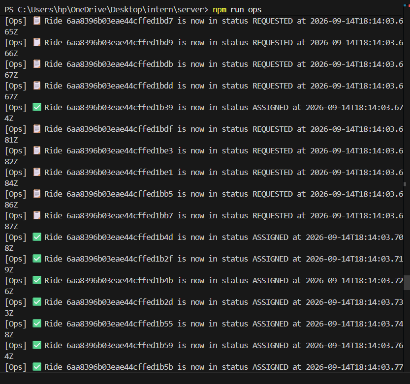
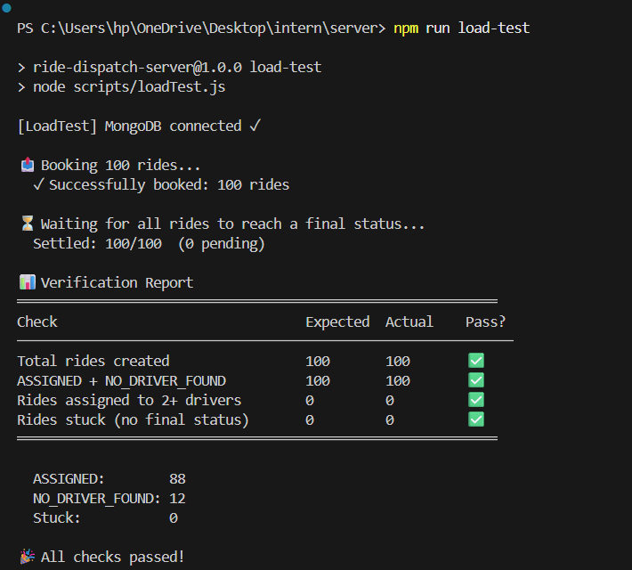

# 🚗 Ride Dispatch System

A simplified **Ola/Uber-style ride booking and dispatch system** built with the MERN stack. Demonstrates async job queues, pub/sub event broadcasting, and concurrent load handling.

---

## 📐 Architecture

```
POST /rides (Express API)
      │
      ▼ enqueue job
 ┌─────────────┐
 │  Bull Queue  │  ← Redis-backed job queue
 └──────┬──────┘
        │ worker picks job
        ▼
 ┌──────────────────────────────────────────┐
 │  Dispatch Worker                         │
 │  • Picks a random available driver       │
 │  • Simulates 50% accept / 50% reject     │
 │  • Max 3 rejections → NO_DRIVER_FOUND    │
 │  • Updates MongoDB ride document         │
 │  • Publishes event to Redis pub/sub      │
 └──────────────────────┬───────────────────┘
                        │
              ┌─────────▼──────────┐
              │  Redis Pub/Sub      │
              │  "ride-events"      │
              └──────┬──────┬──────┘
                     │      │
          ┌──────────▼──┐ ┌─▼────────────────┐
          │  billing.js  │ │  ops.js           │
          │  (Program A) │ │  (Program B)      │
          │  Charging    │ │  Status updates   │
          │  rider for   │ │  for all rides    │
          │  ride X      │ │  (REQUESTED →     │
          └─────────────┘ │   ASSIGNED /       │
                          │   NO_DRIVER_FOUND) │
                          └────────────────────┘
```

**Both subscribers receive ALL events independently** — neither takes events away from the other.

---

## 🛠 Tech Stack

| Layer | Technology | Purpose |
|---|---|---|
| API Server | Node.js + Express | Handles `POST /rides`, returns `rideId` instantly |
| Database | MongoDB + Mongoose | Stores ride documents with status tracking |
| Job Queue | Bull (Redis-backed) | Async dispatch — decouples API from processing |
| Pub/Sub | Redis native pub/sub | Broadcasts status change events to all subscribers |
| Subscribers | Node.js processes | Independent consumers (billing + ops) |

---

## 📁 Project Structure

```
intern/
├── server/
│   ├── src/
│   │   ├── index.js                 # Express API server
│   │   ├── models/
│   │   │   └── Ride.js              # Mongoose schema (status, attempts, assignedDriver)
│   │   ├── data/
│   │   │   └── drivers.js           # 10 hardcoded fake drivers
│   │   ├── queues/
│   │   │   └── rideQueue.js         # Bull queue connected to Redis
│   │   ├── publishers/
│   │   │   └── eventPublisher.js    # Redis pub/sub publisher
│   │   ├── routes/
│   │   │   └── rides.js             # POST /rides + GET /rides/:id
│   │   └── workers/
│   │       └── rideWorker.js        # Dispatch logic (offer → accept/reject loop)
│   ├── subscribers/
│   │   ├── billing.js               # Program A — charges rider on ASSIGNED
│   │   └── ops.js                   # Program B — logs every status change
│   ├── scripts/
│   │   └── loadTest.js              # Books 100 rides + verification report
│   ├── .env
│   ├── .env.example
│   └── package.json
├── output/                          # Screenshots of all task outputs
│   ├── task1_api_server.png
│   ├── task1_worker.png
│   ├── task2_billing.png
│   ├── task2_ops.png
│   └── task3_load_test.png
├── .gitignore
└── README.md
```

---

## ⚙️ Prerequisites

- **Node.js** v18+
- **MongoDB** — running on `localhost:27017`
- **Redis** (or [Memurai](https://www.memurai.com/) on Windows) — running on `localhost:6379`

Verify both are running:
```powershell
# MongoDB
Get-Service MongoDB

# Memurai (Redis on Windows)
Get-Service Memurai
```

---

## 🚀 Setup

```bash
cd server
npm install
cp .env.example .env   # already configured for localhost
```

---

## ▶️ Running the System

Open **4 separate terminals** inside `server/`:

### Terminal 1 — API Server
```bash
npm run dev
```
Starts Express on `http://localhost:3000`. Connects to MongoDB. Returns `rideId` on every `POST /rides`.

### Terminal 2 — Dispatch Worker
```bash
npm run worker
```
Listens to Bull queue. For each ride job:
1. Picks a random driver not yet offered this ride
2. Simulates 50% accept / 50% reject
3. On accept → saves `ASSIGNED` + driver to MongoDB, publishes event
4. On reject → re-queues (up to 3 attempts), then `NO_DRIVER_FOUND`

### Terminal 3 — Program A (Billing)
```bash
npm run billing
```
Subscribes to `ride-events` Redis channel. Prints a charge message for every `ASSIGNED` ride.

### Terminal 4 — Program B (Ops)
```bash
npm run ops
```
Subscribes to `ride-events` Redis channel. Prints every status change (`REQUESTED`, `ASSIGNED`, `NO_DRIVER_FOUND`).

> **Important:** Both `billing` and `ops` subscribe independently — both receive **every** event. No event is "consumed" by one and missed by the other.

---

## 🔌 API Reference

### `POST /rides` — Book a ride

**Request body:**
```json
{
  "riderId": "RIDER_001",
  "pickup": "MG Road",
  "dropoff": "Koramangala"
}
```

**Response `201`:**
```json
{
  "rideId": "664abc123def456...",
  "status": "REQUESTED",
  "message": "Ride booked. Driver is being assigned."
}
```
The response is **immediate** — dispatch happens asynchronously in the background.

### `GET /rides/:id` — Check ride status

**Response:**
```json
{
  "_id": "664abc123def456...",
  "riderId": "RIDER_001",
  "pickup": "MG Road",
  "dropoff": "Koramangala",
  "status": "ASSIGNED",
  "assignedDriver": { "id": "DRV003", "name": "Rahul Mehta" },
  "attempts": 2,
  "offeredDriverIds": ["DRV007", "DRV003"]
}
```

**Status values:**

| Status | Meaning |
|---|---|
| `REQUESTED` | Ride booked, awaiting driver |
| `ASSIGNED` | Driver accepted |
| `NO_DRIVER_FOUND` | All 3 attempts rejected |

---

## 🧪 Task 3 — Load Test (100 Rides)

With all 4 processes running:
```bash
npm run load-test
```

The script:
1. Books 100 rides concurrently via `POST /rides`
2. Polls MongoDB until all 100 reach a terminal status
3. Prints a verification table

---

## 📸 Output Screenshots

### Task 1 — API Server
Server started, connected to MongoDB, publishing 100 `REQUESTED` events.



---

### Task 1 — Dispatch Worker
Worker offering rides to drivers, logging accepts/rejects, publishing ASSIGNED and NO_DRIVER_FOUND events.



---

### Task 2 — Program A: Billing Subscriber
Every `ASSIGNED` ride triggers a charge message. Both billing and ops receive all events independently.



---

### Task 2 — Program B: Ops Subscriber
Every status change (REQUESTED → ASSIGNED / NO_DRIVER_FOUND) is logged in real-time.



---

### Task 3 — Load Test Verification (100 Rides)
All 4 checks pass. 88 rides ASSIGNED, 12 NO_DRIVER_FOUND, 0 stuck, 0 duplicate assignments.



---

## 🔑 Key Design Decisions

### Why Bull instead of a simple `setTimeout`?
Bull uses Redis as a persistent backing store. Jobs survive process restarts and are guaranteed to be processed exactly once — preventing the duplicate-assignment bug the load test checks for.

### Why Redis Pub/Sub instead of HTTP callbacks?
Pub/Sub lets any number of independent subscribers receive every event without any coupling. Adding a third subscriber (e.g., notifications) requires zero changes to the publisher or other subscribers.

### Why a separate worker process?
Keeps the API response time fast (sub-millisecond) regardless of how long dispatch takes. The API just creates the DB record and enqueues — it doesn't wait for a driver.

### Preventing duplicate assignment
The `offeredDriverIds` array on the Ride document ensures each driver is only offered a ride once, and the worker checks the current `status` before processing — so even if a job is processed twice (e.g., after a crash), the second run is a no-op.

---

## 👥 Fake Drivers

| ID | Name |
|---|---|
| DRV001 | Arjun Sharma |
| DRV002 | Priya Nair |
| DRV003 | Rahul Mehta |
| DRV004 | Sunita Rao |
| DRV005 | Vikram Singh |
| DRV006 | Anita Desai |
| DRV007 | Kiran Patel |
| DRV008 | Deepa Joshi |
| DRV009 | Manoj Kumar |
| DRV010 | Sneha Iyer |
